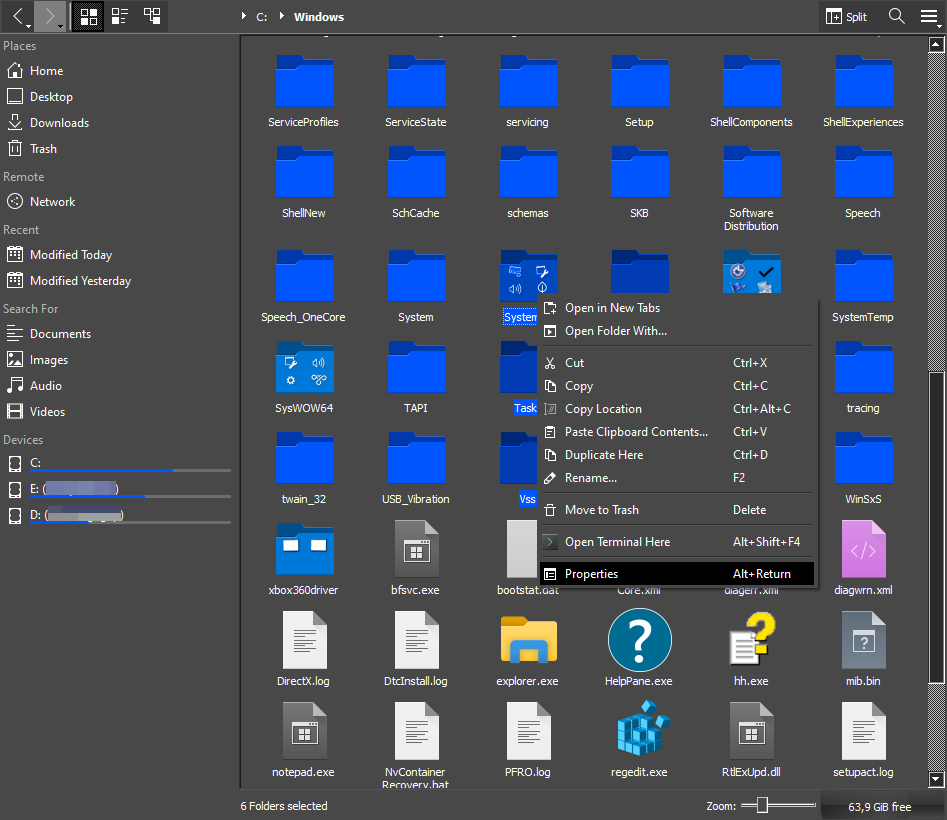

# dolpwin-dark

Dark theme fix for Windows version of [Dolphin File Manager](https://apps.kde.org/dolphin/).

Tested with build [Build #2022 (Sep 8, 2023 10:42:00 PM)](https://binary-factory.kde.org/job/Dolphin_Release_win64/).

## Installation

1. Download and unzip this repository to a folder, e.g.: `C:\Users\USER\dolpwin-dark`.
2. Launch `Dolphin` as

```powershell
dolphin.exe --stylesheet C:\Users\USER\dolpwin-dark\grey.qss --platform windows:darkmode=2
```

Make sure to substitute `USER` for your actual username.

## Screenshot


